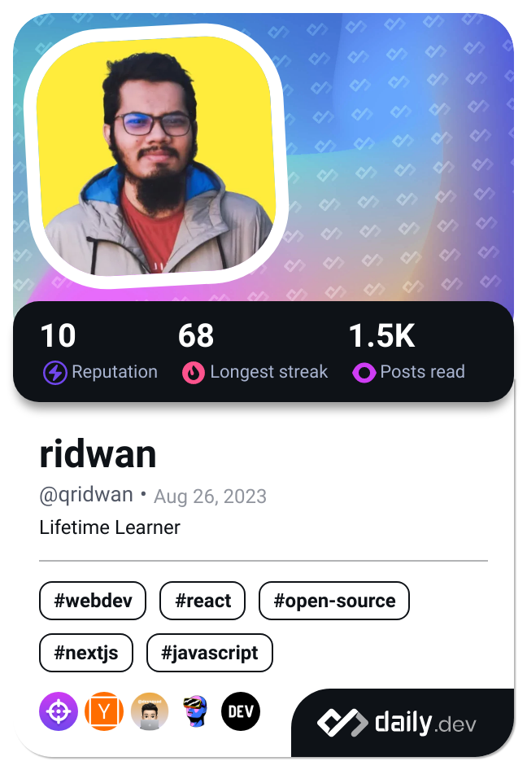

# Hi there, I'm Ridwan 👋

  

  
  
  

---

## 🚀 About Me

<table>
<tr>
<td width="60%">

I'm a **passionate Full-Stack Web Developer** with expertise in modern web technologies. I specialize in building scalable applications using React ecosystem and robust backend solutions.

### 🎯 Current Focus
- 🔭 Working on enterprise-level web applications
- 🌱 Mastering **PostgreSQL** and advanced **ORM** patterns
- 👯 Looking to collaborate on innovative web projects

### 💡 What I Bring
- **Problem Solving**: Turning complex requirements into elegant solutions
- **Performance Optimization**: Building fast, efficient applications
- **Team Collaboration**: Strong communication and teamwork skills
- **Continuous Learning**: Staying updated with latest industry trends

</td>
<td width="40%" align="right">

 

</td>
</tr>
</table>

---

## 🛠️ Technology Stack

### Frontend Development

### Backend Development

### Database & Storage

### Tools & Platforms

---

## 📊 GitHub Analytics

  
  

  

---

## 🏆 GitHub Trophies

  

---

## 📈 Activity Graph

  

---

## 🤝 Let's Connect

📧 **Email**: [404ridwan@qridwan.com](mailto:404ridwan@google.com)  
🌐 **Portfolio**: [ridwan-dev](https://ridwan-dev.web.app/)
💼 **LinkedIn**: [linkedin.com/in/qridwan](https://www.linkedin.com/in/qridwan/)  

*"Code is like humor. When you have to explain it, it's bad."* – Cory House

---

  

